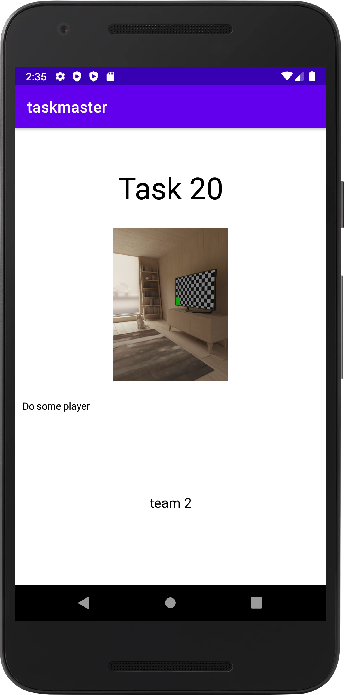

# Taskmaster
You can navigate through three page home , add task and all task page .

After update you can now add you name from setting page then it will appear in the home and you can navigate throug the tasks 

## Recycle view 
In this time I add recycleview to show the task in the main page 

## Room 
Now you can add the task to your sqlite database from add task button 

## AWS 
Now the app is connect with AWS backend and the task is related to the team thats belongs to . 

